# [Homework - Demo](https://github.com/InternLM/Tutorial/blob/camp2/helloworld/homework.md)
提交方式：在 CSDN 、知乎 、Github 等平台上传作业后，将链接贴至 飞书作业板 即可。

基础作业 (结营必做)

使用 InternLM2-Chat-1.8B 模型生成 300 字的小故事（需截图）
进阶作业 (优秀学员必做)

熟悉 huggingface 下载功能，使用 huggingface_hub python 包，下载 InternLM2-Chat-7B 的 config.json 文件到本地（需截图下载过程）
完成 浦语·灵笔2 的 图文创作 及 视觉问答 部署（需截图）
完成 Lagent 工具调用 数据分析 Demo 部署（需截图）

# walkthrough
*the following program executed under the directory `lesson2/` with conda env activated*
*program may not be compatible if running with cpu*

## preparation
1. device

System: Ubuntu 22.04.4 LTS
CPU: Intel(R) Xeon(R) W-2295 CPU @ 3.00GHz
GPU: NVIDIA GeForce RTX 3090

(mac is overwhelmed!)

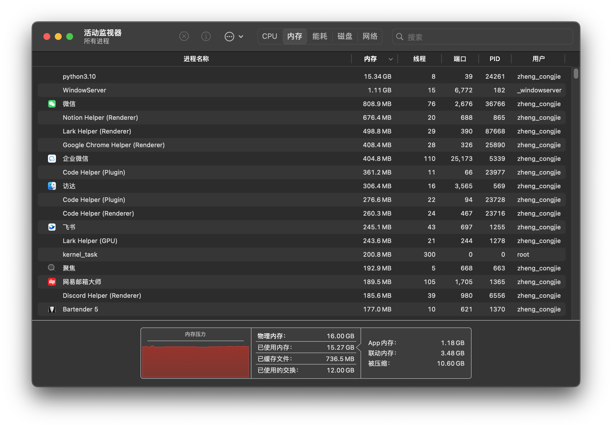

2. code repo preparation

```bash
# internlm2-chat-1.8b
# internlm2-chat-7b
# lagent
# internlm-xcomposer
```

3. env preparation

```bash
### create env
conda create -n l2 python=3.10 -y
conda activate l2
### if cuda available
conda install pytorch==2.0.1 torchvision==0.15.2 torchaudio==2.0.2 pytorch-cuda=11.7 -c pytorch -c nvidia
### if cuda not available, not fully tested
conda install pytorch==2.0.1 torchvision==0.15.2 torchaudio==2.0.2 -c pytorch
### install packages
pip install huggingface-hub==0.17.3 transformers==4.34 psutil==5.9.8 accelerate==0.24.1 streamlit==1.32.2  matplotlib==3.8.3 modelscope==1.9.5 sentencepiece==0.1.99
pip install timm==0.4.12 sentencepiece==0.1.99 markdown2==2.4.10 xlsxwriter==3.1.2 gradio==4.13.0
### install lagent
cd lagent
pip install -e .
```

4. model weight download

run `python model_download.py` modified from the [tutorial](https://github.com/InternLM/Tutorial/blob/camp2/helloworld/hello_world.md#22-%E4%B8%8B%E8%BD%BD-internlm2-chat-18b-%E6%A8%A1%E5%9E%8B) to download weights for models `internlm2-chat-1.8b`, `internlm2-chat-7b`, `internlm-xcomposer2-7b`, `internlm-xcomposer2-vl-7b`.

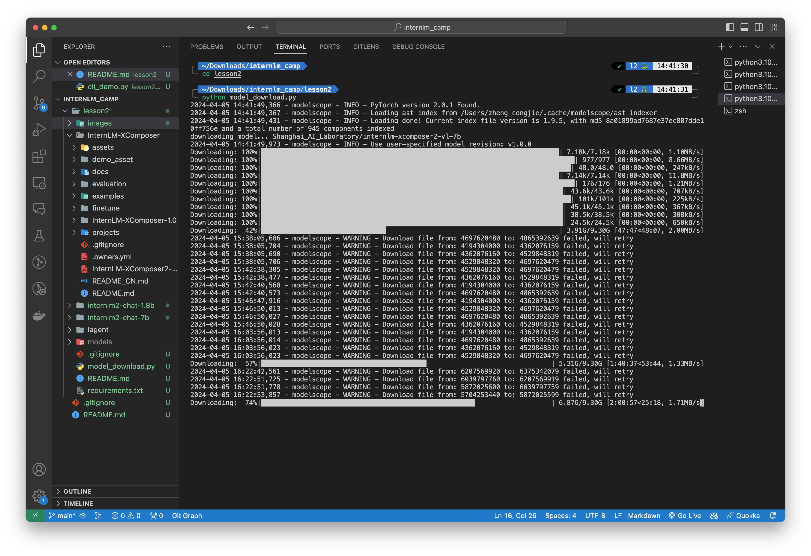 

## basic part
### 1. generate story with InternLM2-Chat-1.8B

run `python internlm2-chat-1.8b/cli_demo.py` modified from the [tutorial](https://github.com/InternLM/Tutorial/blob/camp2/helloworld/hello_world.md#23-%E8%BF%90%E8%A1%8C-cli_demo)

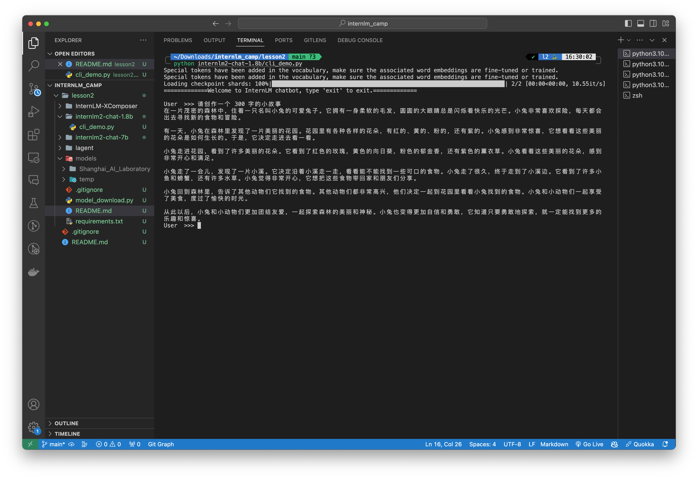

if you want to run with cpu, change the following code.
```python
# internlm2-chat-1.8b/cli_demo.py
...
# line 4
device_map = 'cpu' # added this line so that may change to your preferred device
...
```

## advanced part
### 1. download config.json with huggingface_hub package

run `python internlm2-chat-7b/hf_download.py` following the [official documentation](https://huggingface.co/docs/huggingface_hub/quick-start#download-files) to download config.json stored in `internlm2-chat-7b/cache/`.

model files for [internlm2-chat-7b](https://huggingface.co/internlm/internlm2-chat-7b/tree/main).

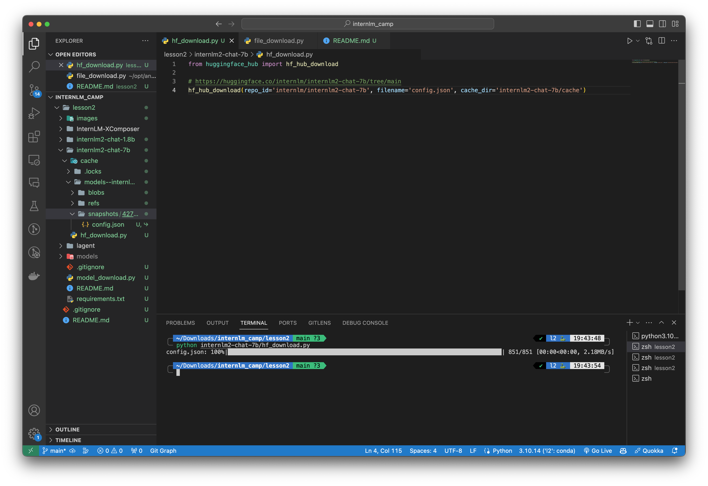

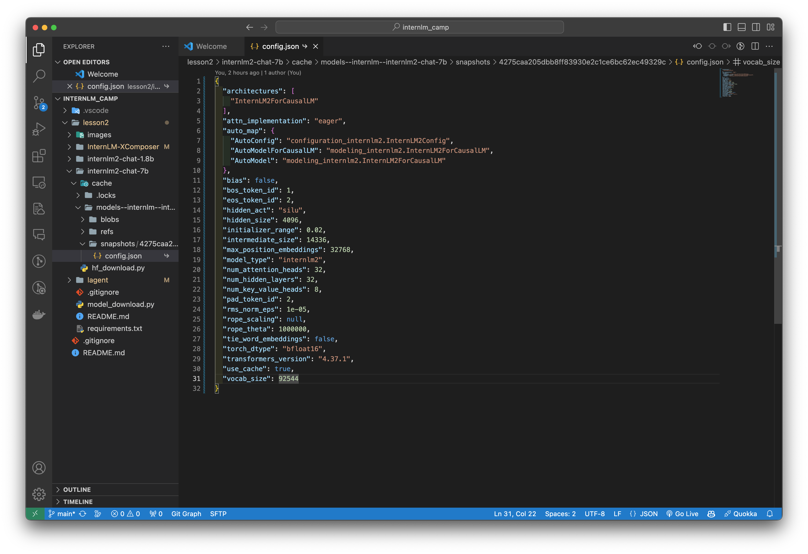

### 2. play with InternLM-XComposer2

1. image-text-generation

`cd InternLM-XComposer/` and run `python examples/gradio_demo_composition.py --code_path ../models/Shanghai_AI_Laboratory/internlm-xcomposer2-7b --private --num_gpus 1 --port 6006`

(will download `clip-vit-large-patch14-336` if no cache)

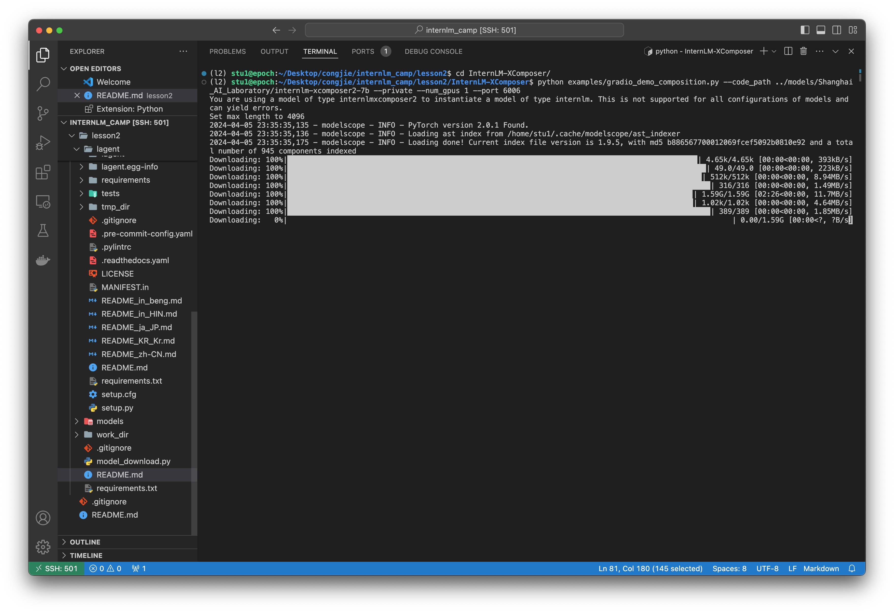

since internlm-xcomposer2-7b is too big for 3090, I run with cpu for over 30 min!

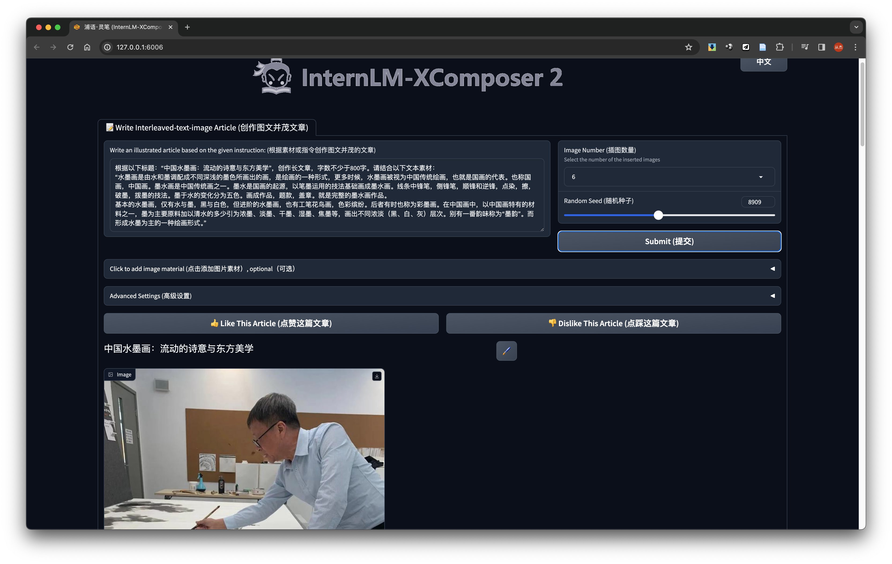

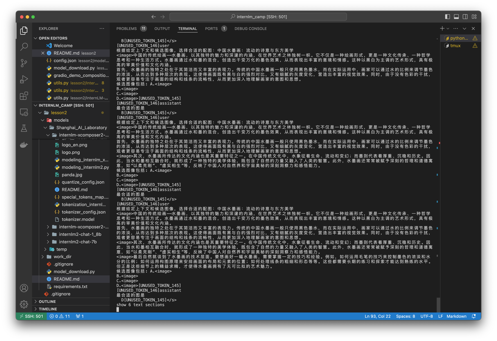

to be compatible with cpu, I have modified the following code so that run with `--num_gpus 0` to enable cpu inference.
```python
# lesson2/InternLM-XComposer/examples/gradio_demo_composition.py
# line 154 - 166, to include cpu device. 
# Note: some operations doesnt support half precision for cpu! eg. RuntimeError: "addmm_impl_cpu_" not implemented for 'Half'
...
        device_map = 'cuda' if num_gpus > 0 else 'cpu' 
        ...
        self.model = AutoModelForCausalLM.from_pretrained(code_path, device_map=self.device_map, trust_remote_code=True)
        if num_gpus > 0:
            self.model = self.model.half()
        self.model.eval()
        ...
        stop_words_ids = torch.tensor([92397], device=self.device_map)
...
# rest of the lines
# change `with torch.cuda.amp.autocast():` to `with torch.autocast(device_type=self.device_map):`
# change `tensor.cuda()` to `tensor.to(self.device_map)`
```
```python
# lesson2/InternLM-XComposer/examples/utils.py
# line 49
...
        stop_words_ids = [torch.tensor([i]).to(stop_words_ids.device) for i in stop_words_ids]
...
```

2. visual-question-answer

`cd InternLM-XComposer/` and run `python examples/gradio_demo_chat.py --code_path ../models/Shanghai_AI_Laboratory/internlm-xcomposer2-vl-7b --private --num_gpus 1 --port 6006`

if you want to run with cpu, follow the above implementations.

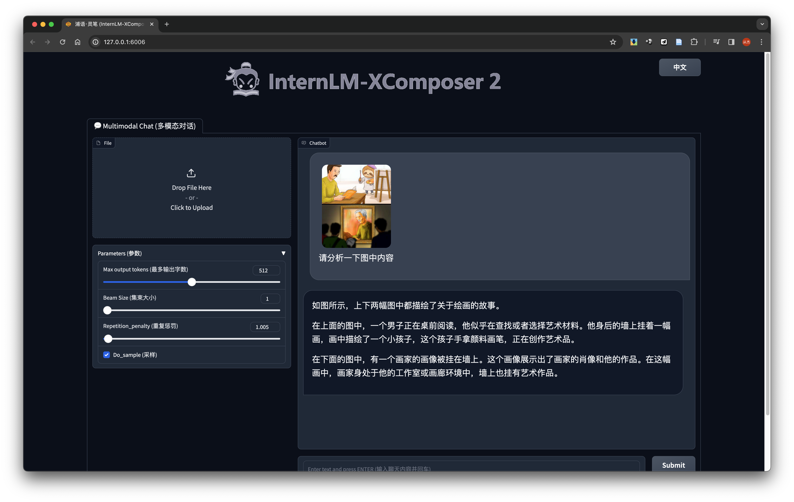

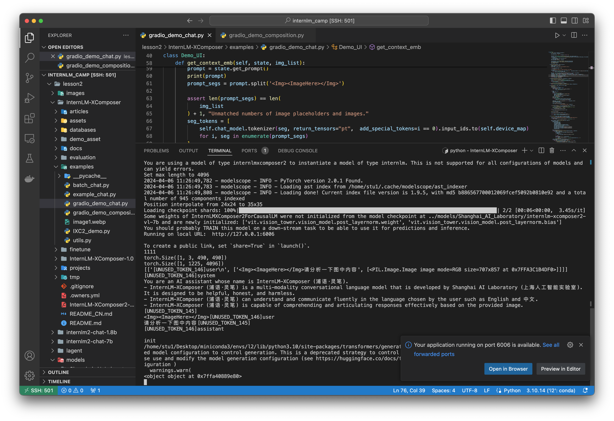


### 3. play with Lagent

change model path before running the code.
```python
# lesson2/lagent/examples/internlm2_agent_web_demo_hf.py
# line 70 - 71
...
        model_path = st.sidebar.text_input(
            '模型路径：', value='models/Shanghai_AI_Laboratory/internlm2-chat-7b')
...
```

run `streamlit run lagent/examples/internlm2_agent_web_demo_hf.py --server.address 127.0.0.1 --server.port 6006`

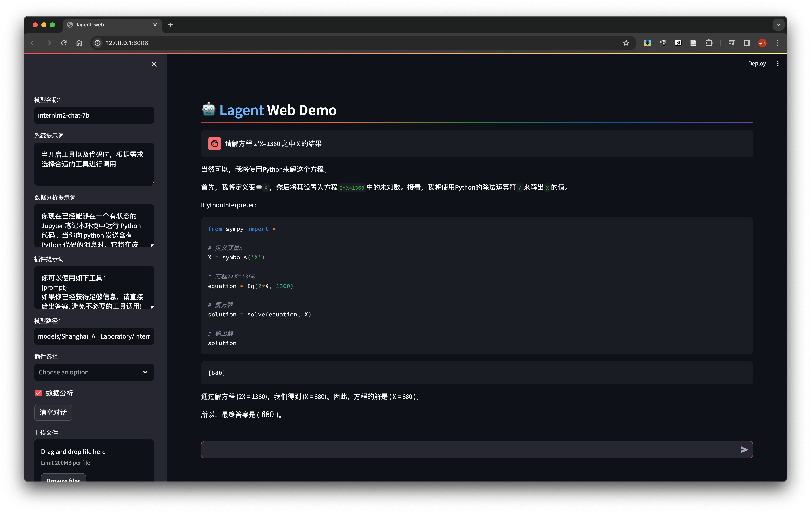

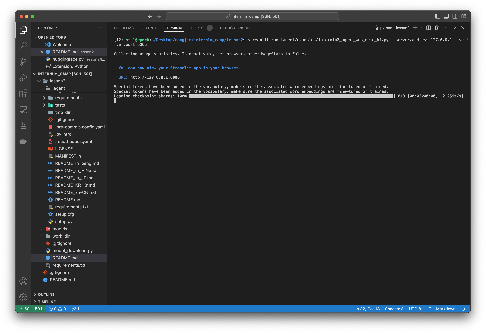

if you want to run with cpu, refer to the above modifications.
