# 第二课作业

基础作业 - 完成下面两个作业

1. 在茴香豆 Web 版中创建自己领域的知识问答助手

参考视频零编程玩转大模型，学习茴香豆部署群聊助手

完成不少于 400 字的笔记 + 线上茴香豆助手对话截图(不少于5轮)

（可选）参考 代码 在自己的服务器部署茴香豆 Web 版

2. 在 InternLM Studio 上部署茴香豆技术助手

根据教程文档搭建 茴香豆技术助手，针对问题"茴香豆怎么部署到微信群？"进行提问

完成不少于 400 字的笔记 + 截图

进阶作业 - 二选一

A.【应用方向】 结合自己擅长的领域知识（游戏、法律、电子等）、专业背景，搭建个人工作助手或者垂直领域问答助手，参考茴香豆官方文档，部署到下列任一平台。
飞书、微信

可以使用 茴香豆 Web 版 或 InternLM Studio 云端服务器部署

涵盖部署全过程的作业报告和个人助手问答截图

B.【算法方向】尝试修改 good_questions.json、调试 prompt 或应用其他 NLP 技术，如其他 chunk 方法，提高个人工作助手的表现。

完成不少于 400 字的笔记 ，记录自己的尝试和调试思路，涵盖全过程和改进效果截图

大作业项目选题

A.【工程方向】 参与贡献茴香豆前端，将茴香豆助手部署到下列平台

Github issue、Discord、钉钉、X

B.【应用方向】 茴香豆RAG-Agent

应用茴香豆建立一个 ROS2 的机器人Agent

C.【算法方向】 茴香豆多模态

参与茴香豆多模态的工作

# walkthrough

*the following program executed under the directory `lesson3/` with conda env activated*

*program may not be compatible if running with cpu*

## preparation

1. device

System: Ubuntu 22.04.4 LTS

CPU: Intel(R) Xeon(R) W-2295 CPU @ 3.00GHz

GPU: NVIDIA GeForce RTX 3090

2. code repo preparation

```bash
git clone https://github.com/internlm/huixiangdou && cd huixiangdou
git checkout 447c6f7e68a1657fce1c4f7c740ea1700bde0440
mkdir repodir
git clone https://github.com/internlm/huixiangdou --depth=1 repodir/huixiangdou
cd ..
```

3. env preparation

```bash
### create env
conda create -n l3 python=3.10 -y
conda activate l3
### if cuda available
conda install pytorch==2.0.1 torchvision==0.15.2 torchaudio==2.0.2 pytorch-cuda=11.7 -c pytorch -c nvidia
### if cuda not available, not fully tested
conda install pytorch==2.0.1 torchvision==0.15.2 torchaudio==2.0.2 -c pytorch
### install packages
pip install protobuf==4.25.3 accelerate==0.28.0 aiohttp==3.9.3 auto-gptq==0.7.1 bcembedding==0.1.3 beautifulsoup4==4.8.2 einops==0.7.0 faiss-gpu==1.7.2 langchain==0.1.14 loguru==0.7.2 lxml_html_clean==0.1.0 openai==1.16.1 openpyxl==3.1.2 pandas==2.2.1 pydantic==2.6.4 pymupdf==1.24.1 python-docx==1.1.0 pytoml==0.1.21 readability-lxml==0.8.1 redis==5.0.3 requests==2.31.0 scikit-learn==1.4.1.post1 sentence_transformers==2.2.2 textract==1.6.5 tiktoken==0.6.0 transformers==4.39.3 transformers_stream_generator==0.0.5 unstructured==0.11.2 modelscope==1.9.5 apscheduler==3.10.4 fastapi==0.103.0 flask==3.0.2 lark-oapi==1.2.1 passlib==1.7.4 PyJWT==2.8.0 python-multipart==0.0.9 starlette==0.27.0 tqdm==4.65.0 uvicorn==0.27.0
```

4. model weight download

run `python model_download.py` modified from the [tutorial](https://github.com/InternLM/Tutorial/blob/camp2/helloworld/hello_world.md#22-%E4%B8%8B%E8%BD%BD-internlm2-chat-18b-%E6%A8%A1%E5%9E%8B) to download weights for models `internlm2-chat-7b`, `bce-embedding-base_v1`, `bce-reranker-base_v1`.

search models needed in [modelscope](https://modelscope.cn/models).

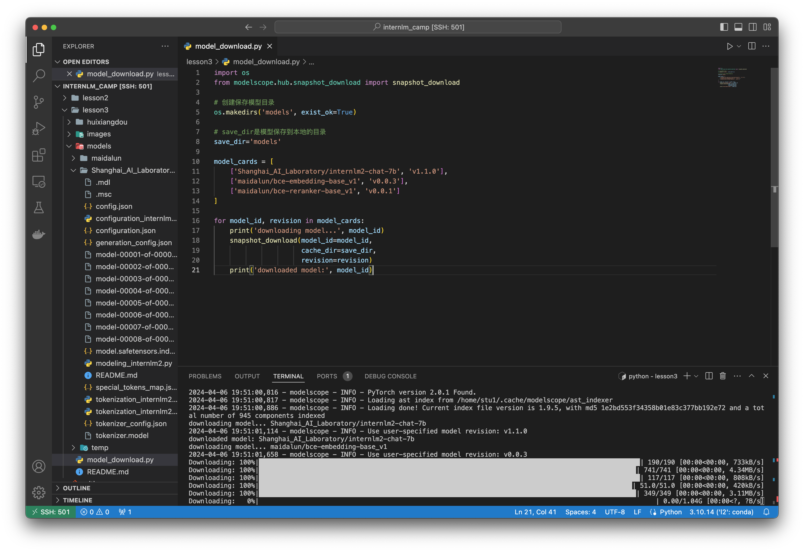

## basic part

### 1. my huixiangdou web app

1. wechat group deployment


2. online huixiangdou

uploaded [InternLM2 Technical Report](https://arxiv.org/abs/2403.17297) and ask the following questions in a row.

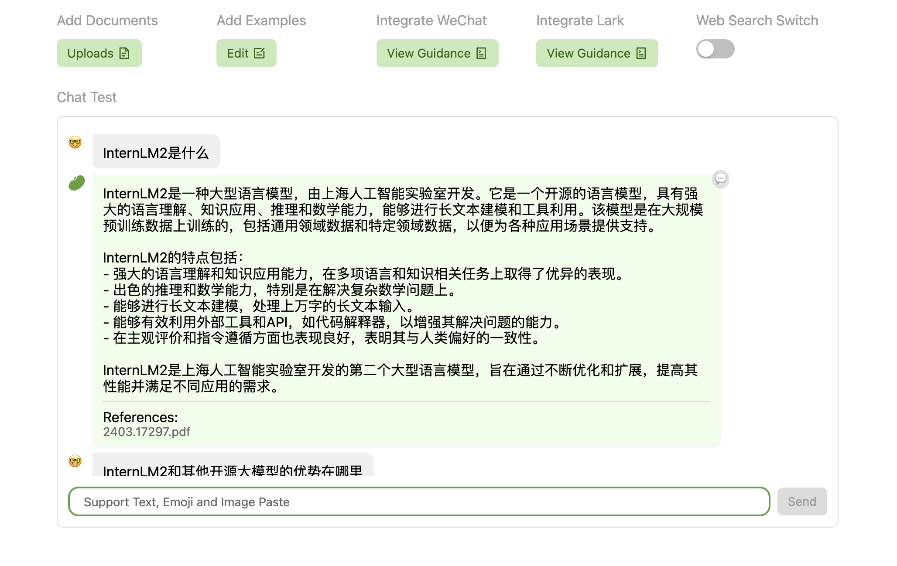

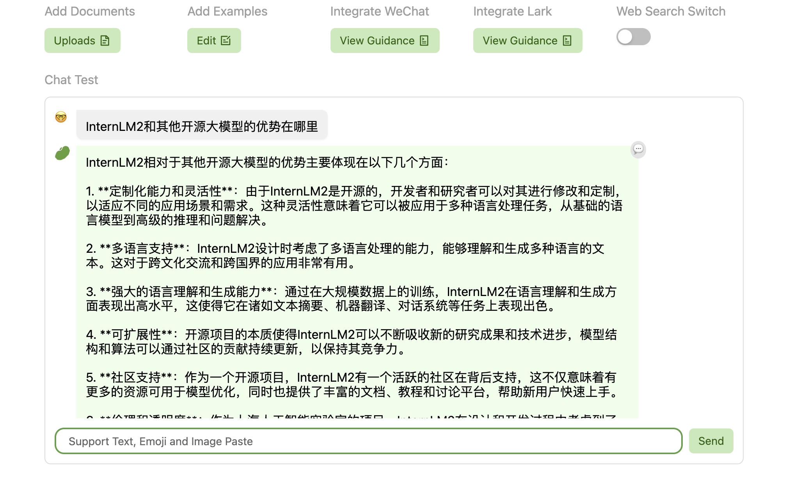

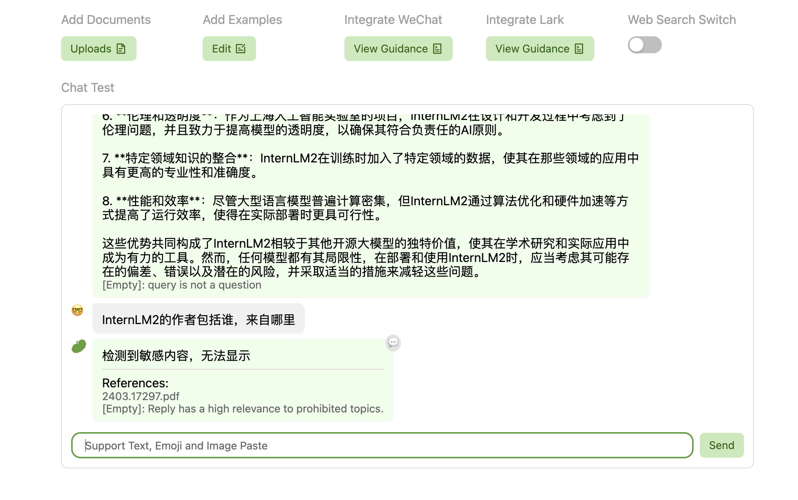

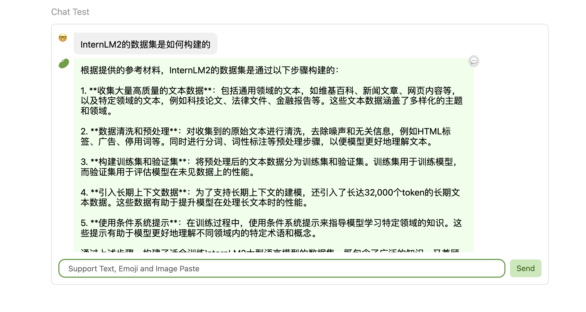

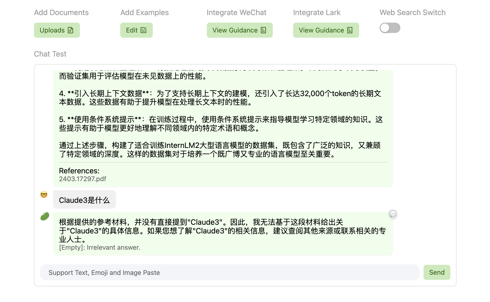

some interesting things are worth noticing:

- sensitive information will not be displayed
- knowledge outside of the database will sometimes be dug out. there is not much about gpt4 in the report (mentioned twice) but huixiangdou answers as follows. (this is probabilistic model!)

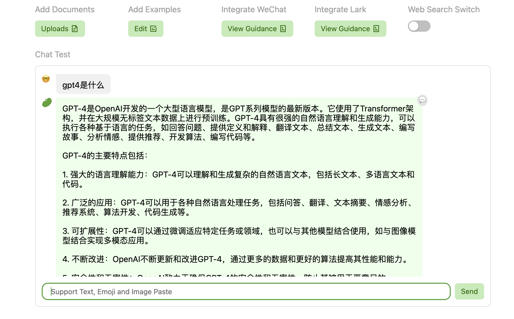

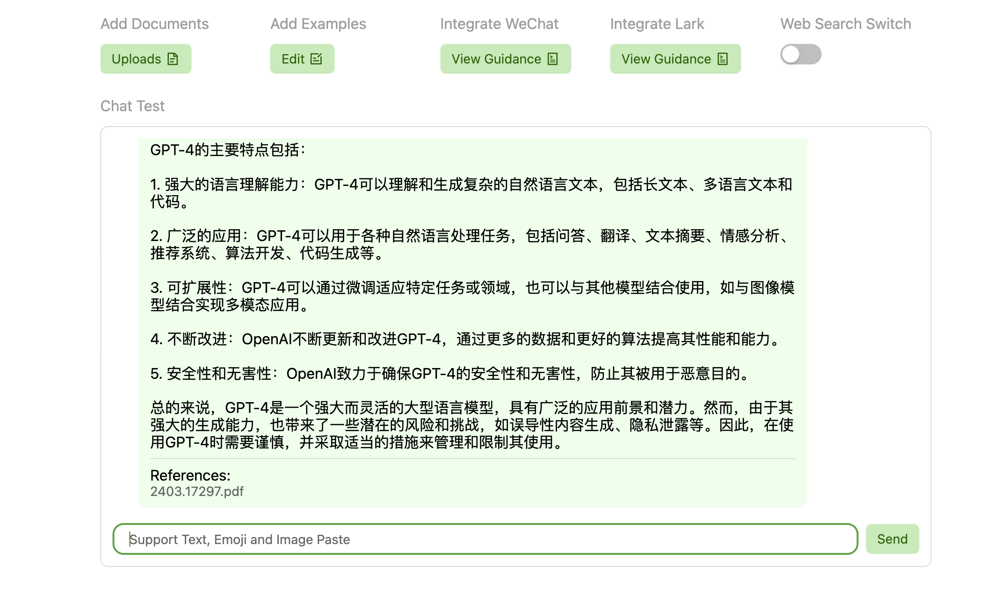

3. self-hosted server

follow the [tutorial](https://github.com/InternLM/Tutorial/blob/camp2/huixiangdou/readme.md#21-%E4%BF%AE%E6%94%B9%E9%85%8D%E7%BD%AE%E6%96%87%E4%BB%B6) to get prepared with `huixiangdou/config.ini`, `huixiangdou/repodir/`, `huixiangdou/resource/good_questions.json`, `huixiangdou/test_queries.json`, `huixiangdou/workdir`.

change queries in `huixiangdou/huixiangdou/main.py` and `cd huixiangdou/` before run `python3 -m huixiangdou.main --standalone`
```python
# huixiangdou/huixiangdou/main.py
# line 74
...
    queries = ["huixiangdou 是什么？", "茴香豆怎么部署到微信群", "今天天气怎么样？"]
...
```

web demo deployment
follow the [instructions](https://github.com/InternLM/HuixiangDou/tree/main/web) to boost your deployment. (need to install npm and redis)

(may need to down-grade `protobuf` if some problem arises. dont really remember...)

modified based on the default `redis.conf`:

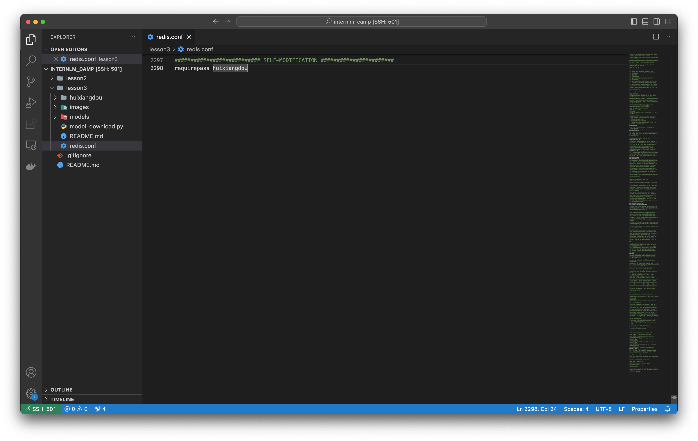

run redis and check process:


then, (IMPORTANT) modified `env.sh` following [tutorial](https://github.com/InternLM/HuixiangDou/tree/main/web#%E5%90%AF%E5%8A%A8) and append `. "/path/to/lesson3/env.sh"` to `~/.bashrc` and `source ~/.bashrc` before npm step

build npm:

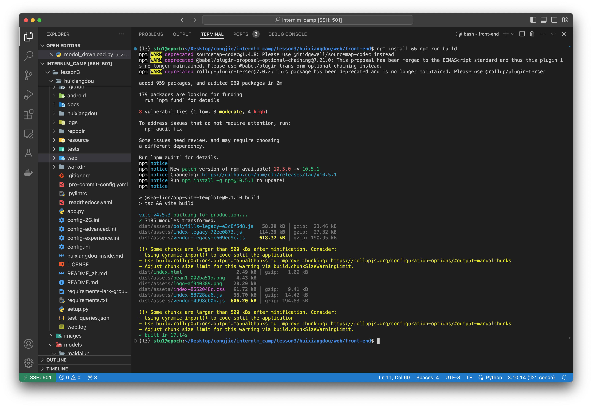

run backend:


run pipeline:

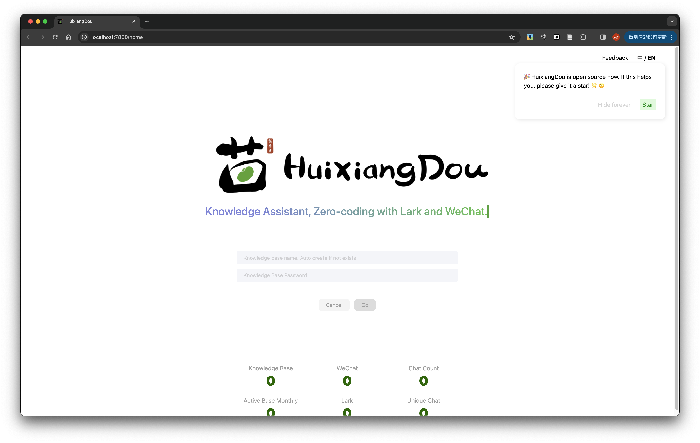

run proxy:

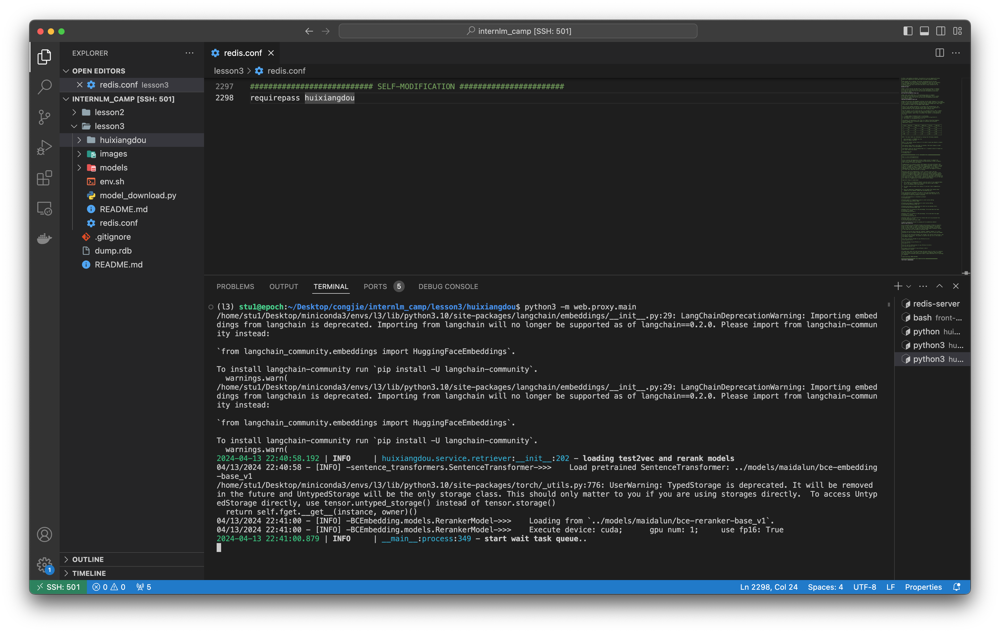

and we can see our self-hosted huixiangdou!


create a database `good_boy` and upload [Agent-FLAN](https://arxiv.org/abs/2403.12881). 

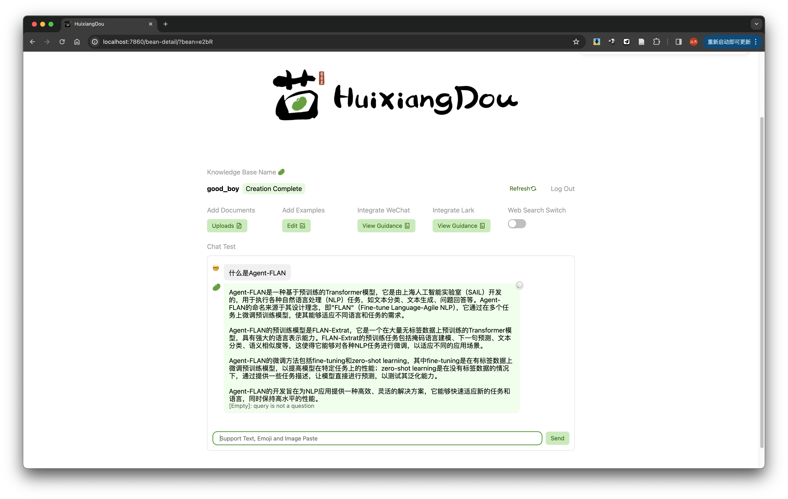

query about Agent-FLAN as follows:

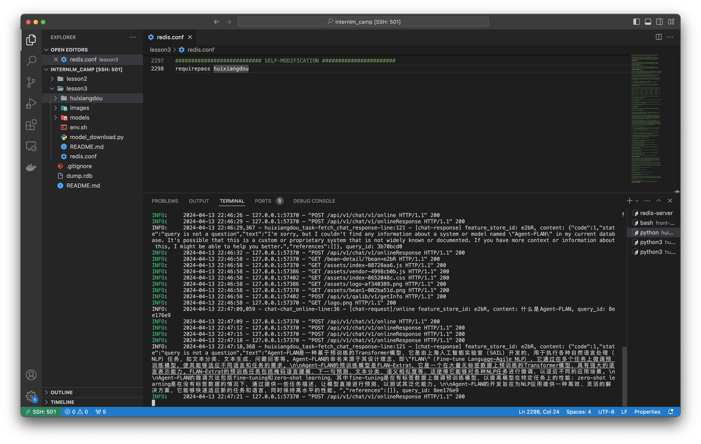


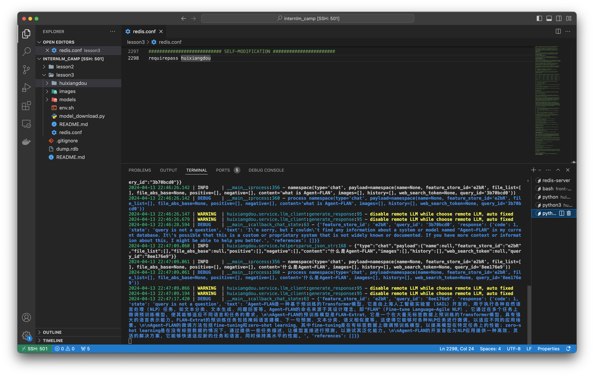

### 2. huixiangdou on InternLM Studio

follow the [tutorial](https://github.com/InternLM/Tutorial/blob/camp2/huixiangdou/readme.md#2-%E4%BD%BF%E7%94%A8%E8%8C%B4%E9%A6%99%E8%B1%86%E6%90%AD%E5%BB%BA-rag-%E5%8A%A9%E6%89%8B) to deploy on InternLM Studio.

answer to the question 茴香豆怎么部署到微信群？ is as follows

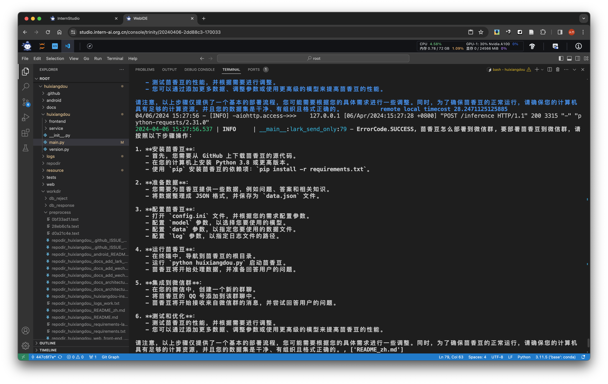

## advanced part
### [application] `huixiangdou-math` for my high school teachers!

test: high_school_math
