# 第五节课作业（请交到第5节课）

## 基础作业（结营必做）

完成以下任务，并将实现过程记录截图：

- 配置 LMDeploy 运行环境
- 以命令行方式与 InternLM2-Chat-1.8B 模型对话

## 进阶作业

完成以下任务，并将实现过程记录截图：

- 设置KV Cache最大占用比例为0.4，开启W4A16量化，以命令行方式与模型对话。（优秀学员必做）
- 以API Server方式启动 lmdeploy，开启 W4A16量化，调整KV Cache的占用比例为0.4，分别使用命令行客户端与Gradio网页客户端与模型对话。（优秀学员）
- 使用W4A16量化，调整KV Cache的占用比例为0.4，使用Python代码集成的方式运行internlm2-chat-1.8b模型。（优秀学员必做）
- 使用 LMDeploy 运行视觉多模态大模型 llava gradio demo （优秀学员必做）
- 将 LMDeploy Web Demo 部署到 [OpenXLab](https://github.com/InternLM/Tutorial/tree/camp2/tools/openxlab-deploy) （OpenXLab cuda 12.2 的镜像还没有 ready，可先跳过，一周之后再来做）

# walkthrough

## basic part

### 1. config LMDeploy

config LMDeploy on studio platform.

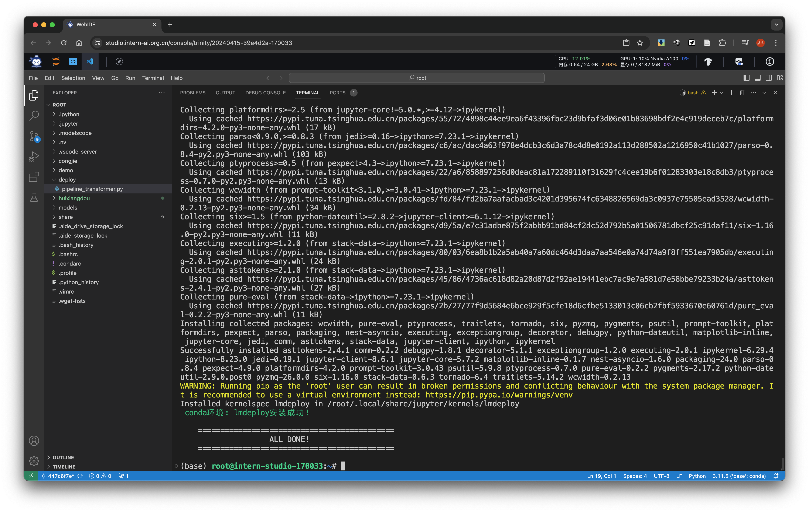

create and run `pipeline_transformer.py` following the [code](https://github.com/InternLM/Tutorial/blob/camp2/lmdeploy/README.md#23-%E4%BD%BF%E7%94%A8transformer%E5%BA%93%E8%BF%90%E8%A1%8C%E6%A8%A1%E5%9E%8B) and test env is ready.

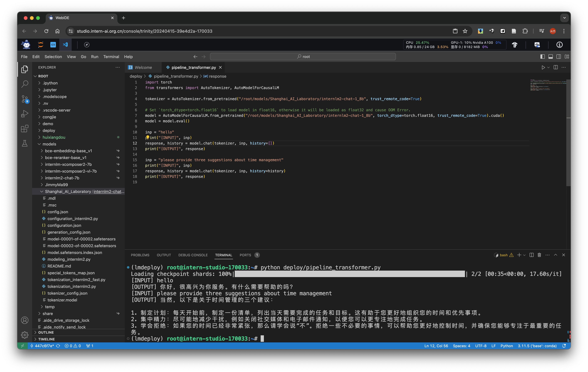

### 2, chat with InternLM2-Chat-1.8B through command line

run `lmdeploy chat /path/to/internlm2-chat-1_8b` to enable command line chat with InternLM2-Chat-1.8B. and the generation speed is awesome!

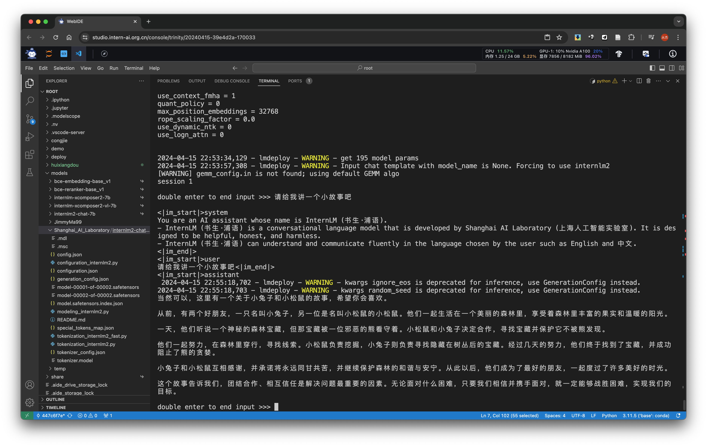

## advanced part

### 1. KV Cache 0.4, W4A16 quantization, chat through command line

before enable KV Cache 0.4, W4A16 quantization, running internlm2-chat-1_8b will require:

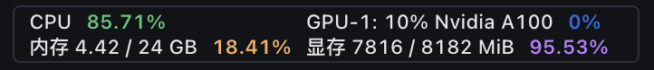

append param `--cache-max-entry-count ${ratio}` to command `lmdeploy` to config the KV Cache.

`pip install einops==0.7.0` run `lmdeploy lite auto_awq /path/to/internlm2-chat-1_8b --calib-dataset 'ptb' --calib-samples 128 --calib-seqlen 1024 --w-bits 4 --w-group-size 128 --work-dir /path/to/internlm2-chat-1_8b-4bit` to export 4bit model.

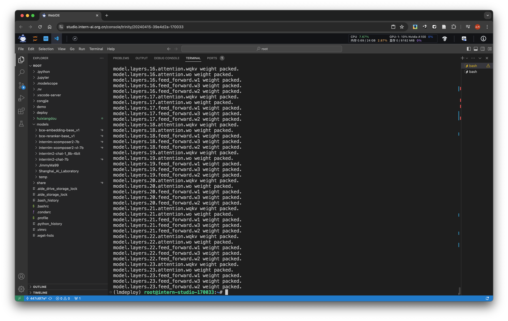

run `lmdeploy chat /path/to/internlm2-chat-1_8b-4bit --cache-max-entry-count 0.4 --model-format awq` to run KV Cache 0.4, W4A16 quantization. we can see a significant reduce on GPU memory usage and speed up inference.

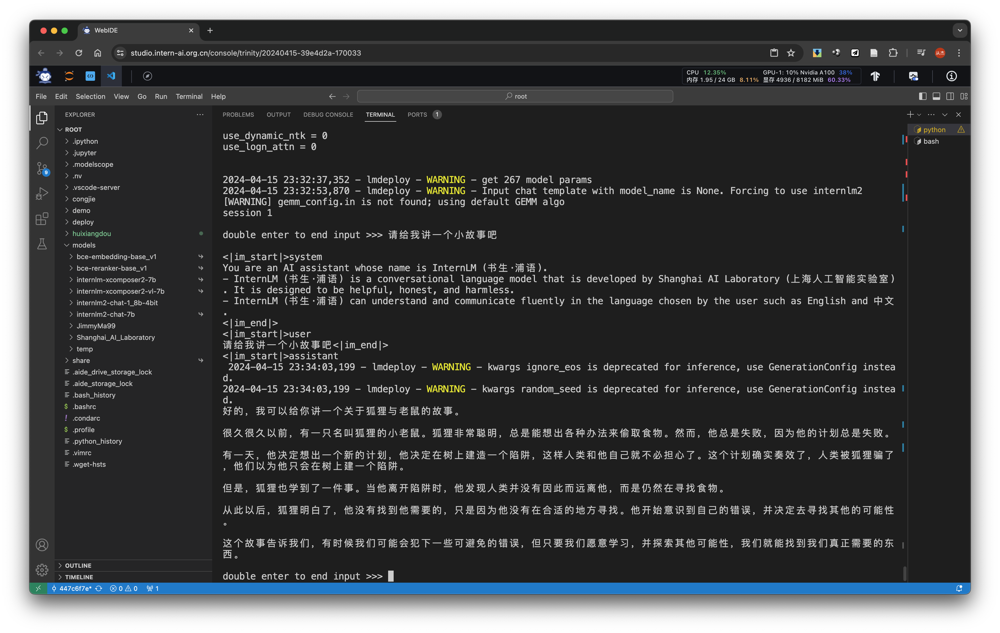

### 2. LMDeploy with API Server, KV Cache 0.4, W4A16 quantization, chat through command line and gradio

run `lmdeploy serve api_server /path/to/internlm2-chat-1_8b-4bit --model-format awq --quant-policy 4 --server-name 0.0.0.0 --server-port 23333 --tp 1` to set up api server with KV Cache 0.4, W4A16 quantization

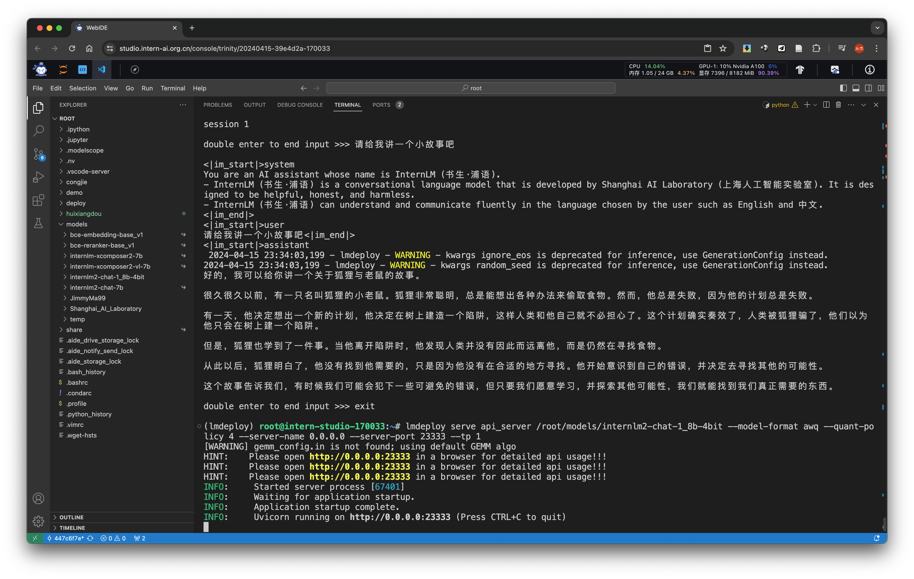

check 127.0.0.1:23333 to see how to use api

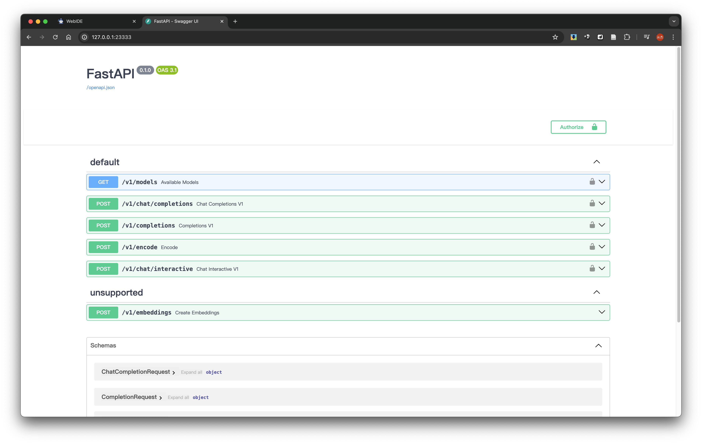

run `lmdeploy serve api_client http://localhost:23333` to enable command chat front-end

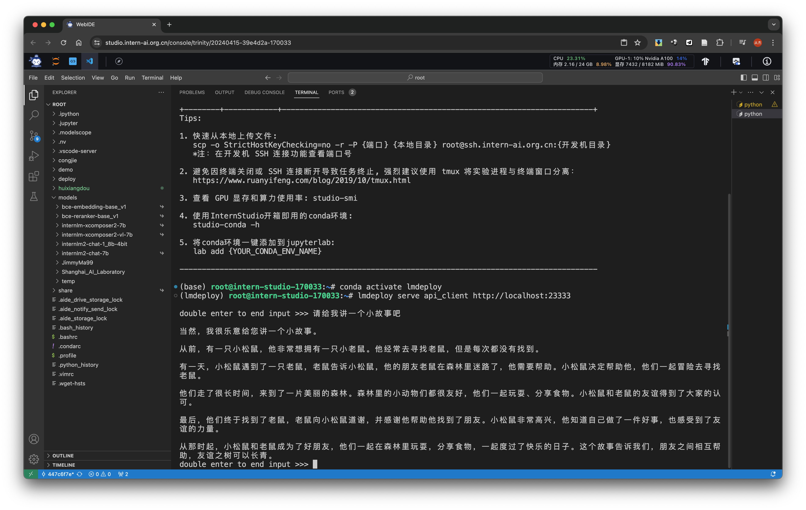

run `lmdeploy serve gradio http://localhost:23333 --server-name 0.0.0.0 --server-port 6006` to enable gradio front-end

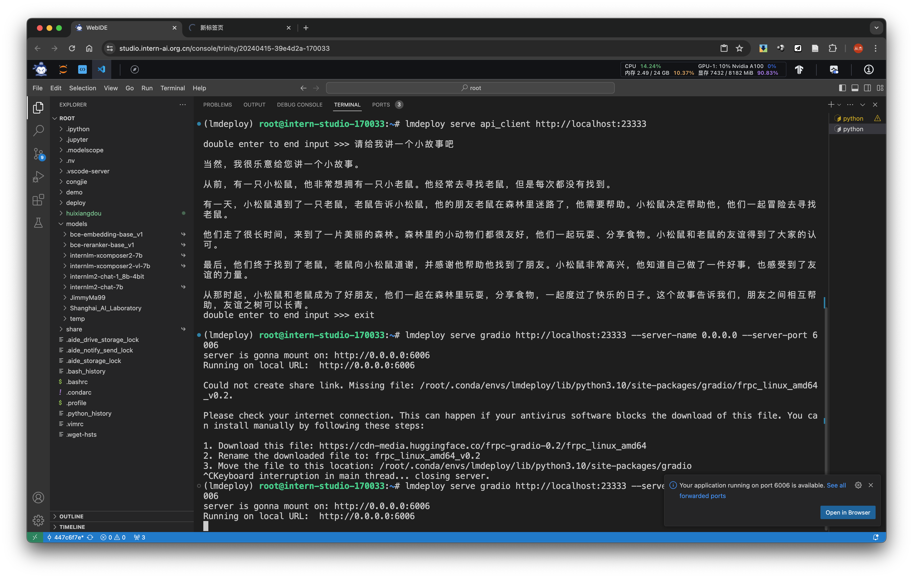

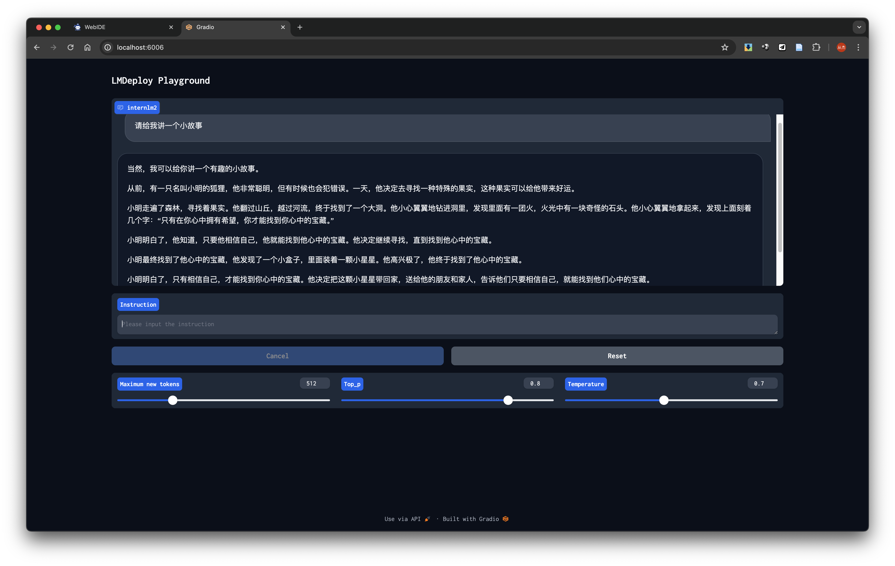

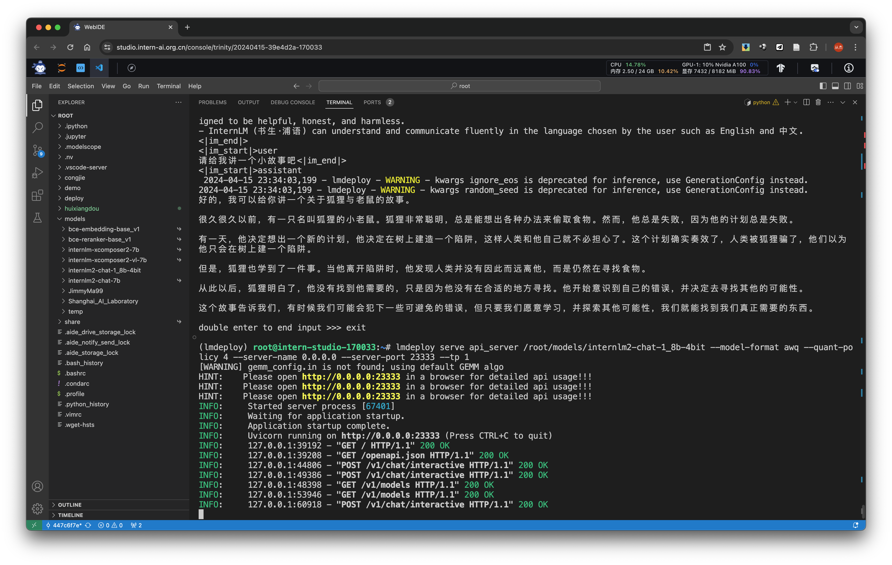

### 3. KV Cache 0.4, W4A16 quantization, chat through coding

create and run `pipeline_kv.py` to enable in-code using of LMDeploy. note: use TurbomindEngineConfig to specify KV Cache 0.4 and 4bit model to use W4A16 quantization

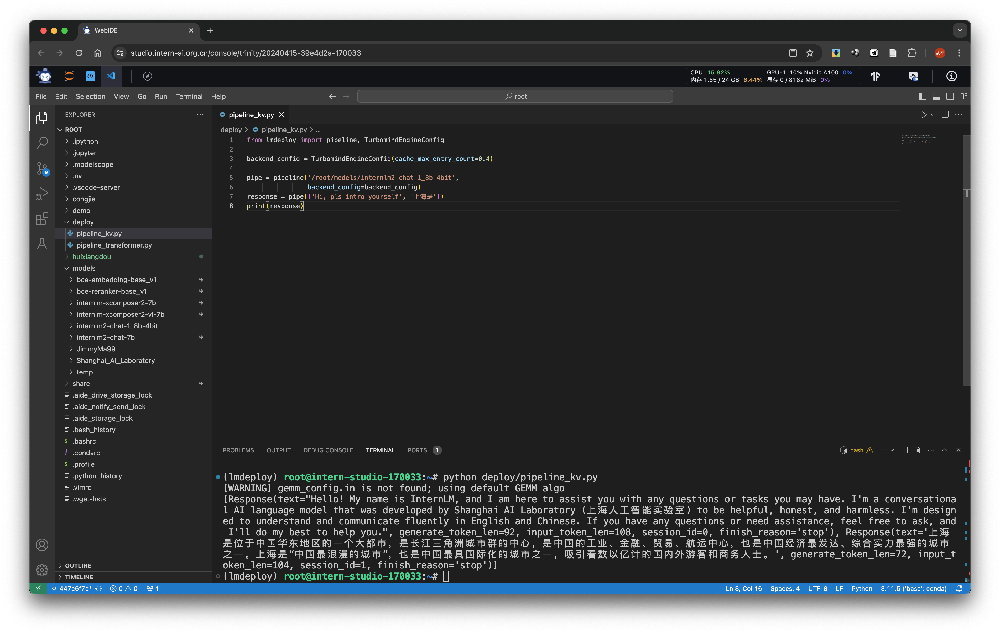

### 4. llava gradio demo with LMDeploy

pip install necessary requirements and create and run `pipeline_llava.py` to enable multi-modal model deploy

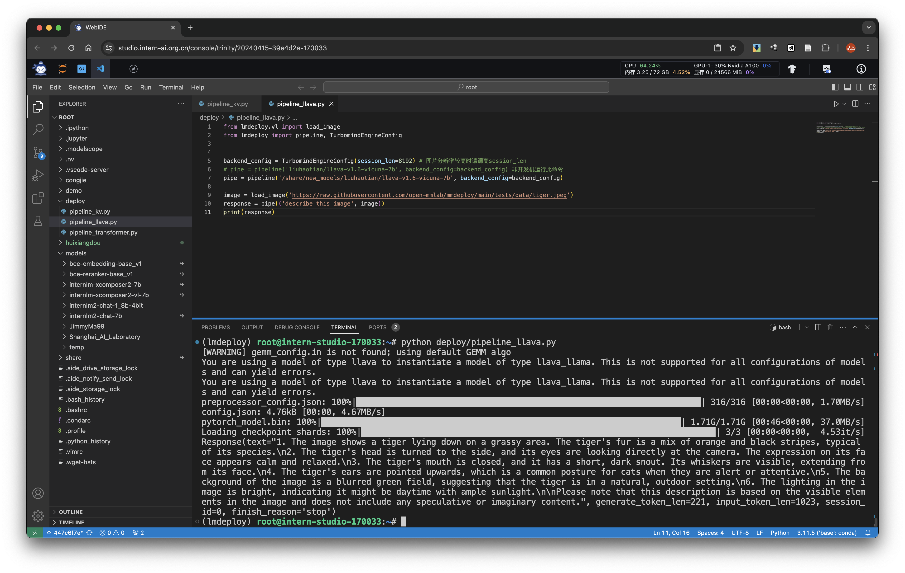

next, create and run `gradio_llava.py` to directly start a gradio web

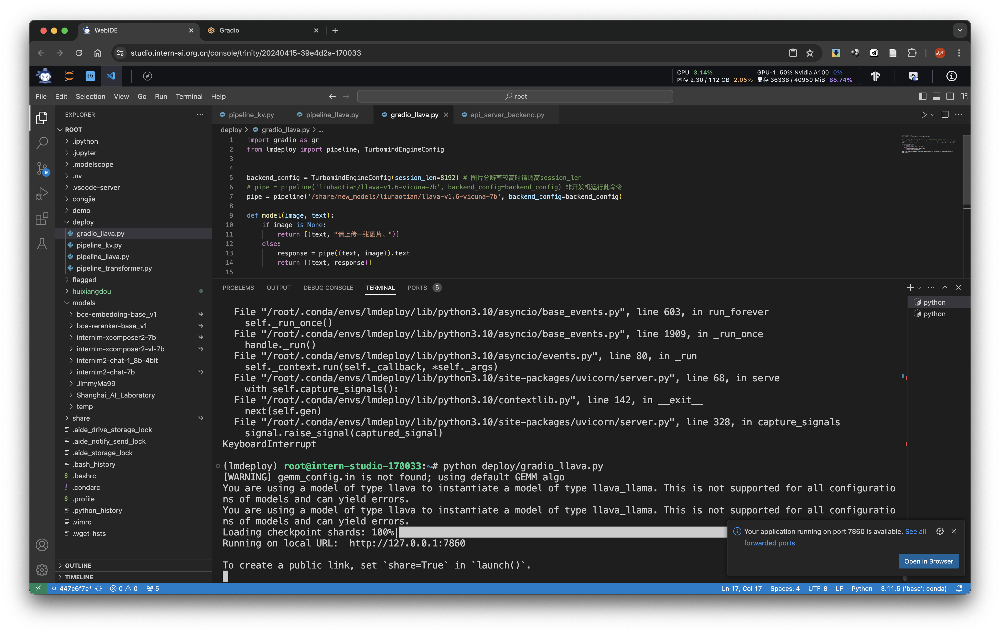

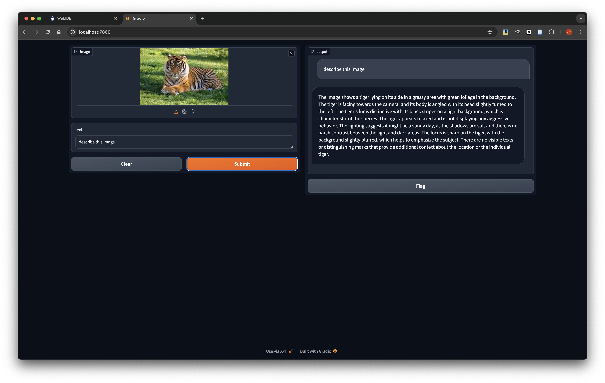

### 5. LMDeploy Web Demo on OpenXLab

https://github.com/InternLM/Tutorial/tree/camp2/tools/openxlab-deploy

https://huggingface.co/spaces/internlm/InternLM2-Chat-20B-TurboMind-4Bits