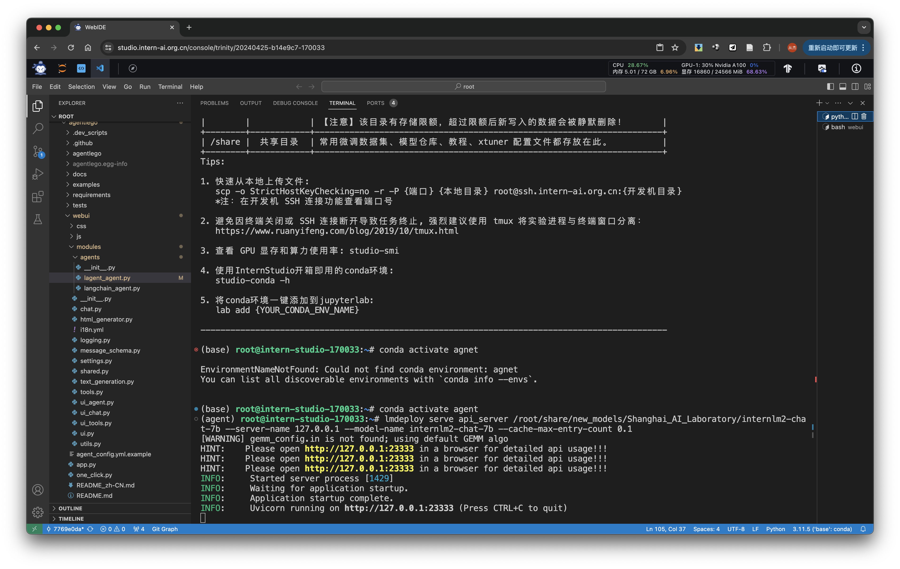
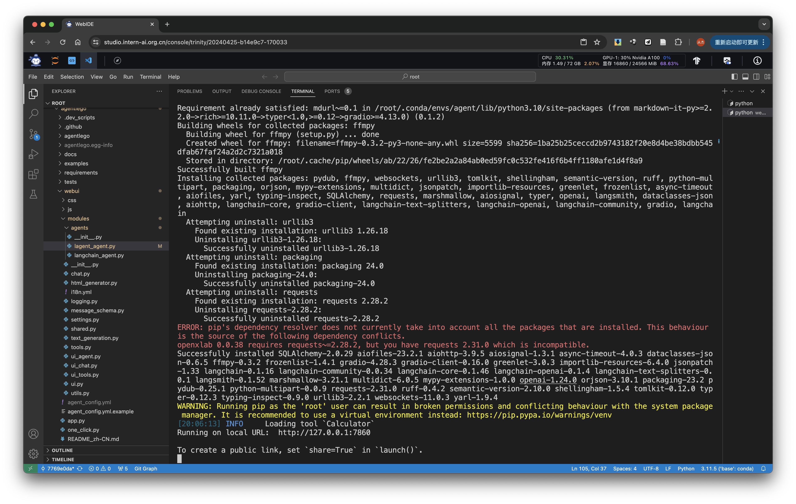
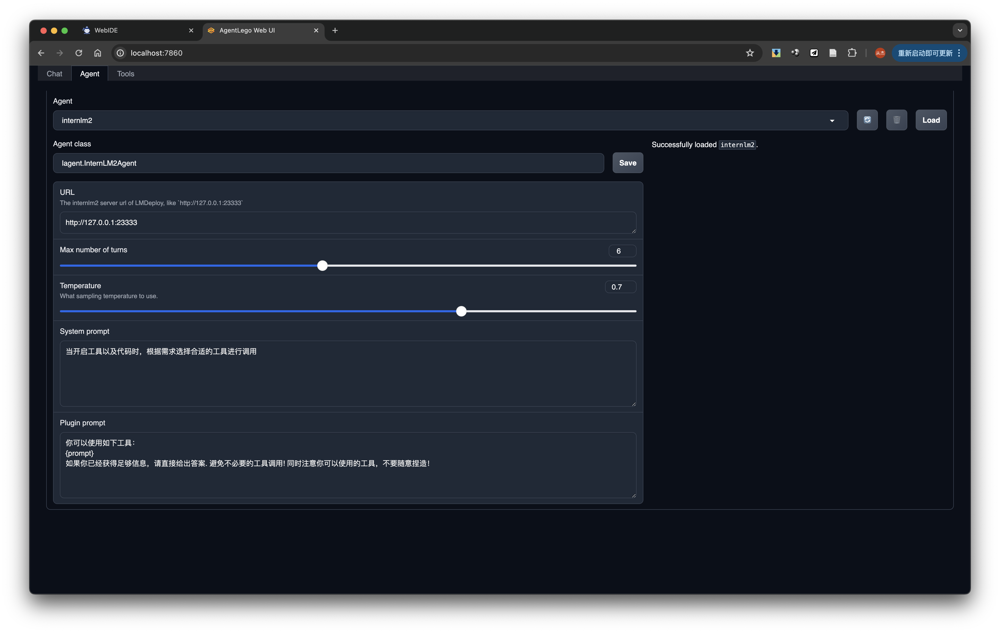
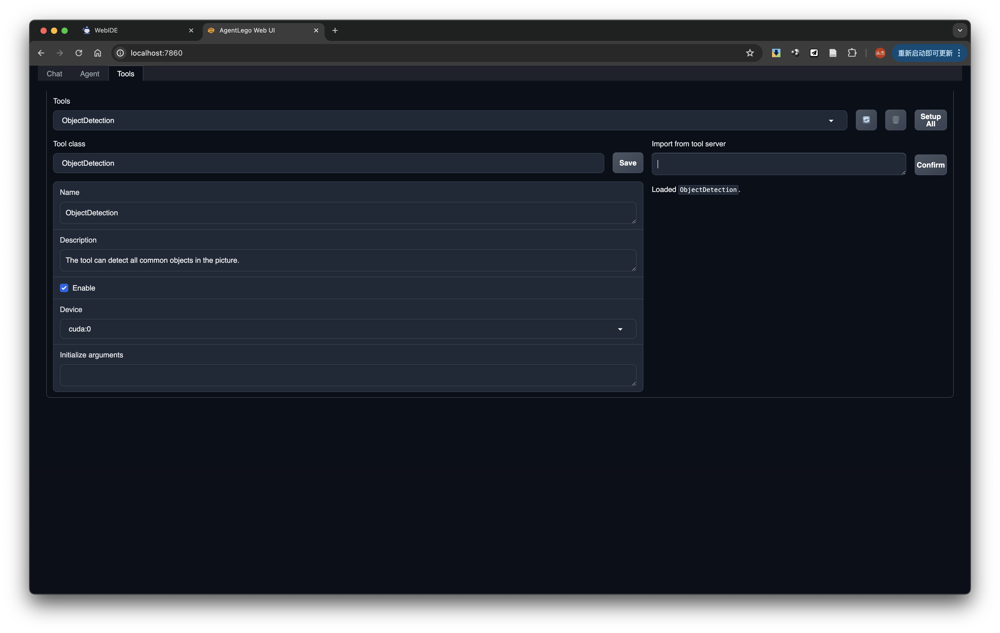
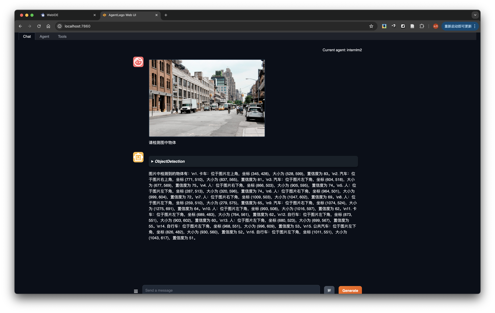
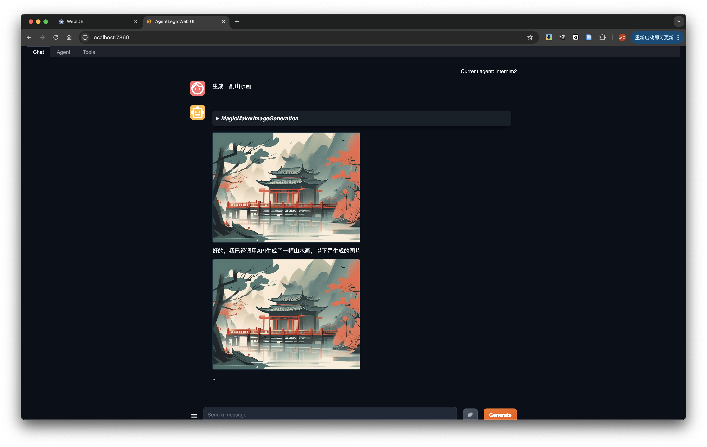

# 作业
Tip

结营必做基础作业；优秀学员或进入对应 SIG 需完成进阶作业。

基础作业

完成 Lagent Web Demo 使用，并在作业中上传截图。文档可见 Lagent Web Demo

完成 AgentLego 直接使用部分，并在作业中上传截图。文档可见 直接使用 AgentLego。

进阶作业

完成 AgentLego WebUI 使用，并在作业中上传截图。文档可见 AgentLego WebUI。

使用 Lagent 或 AgentLego 实现自定义工具并完成调用，并在作业中上传截图。文档可见：

用 Lagent 自定义工具

用 AgentLego 自定义工具

大作业选题

算法方向

在 Lagent 或 AgentLego 中实现 RAG 工具，实现智能体与知识库的交互。

基于 Lagent 或 AgentLego 实现工具的多轮调用，完成复杂任务。如：智能体调用翻译工具，再调用搜索工具，最后调用生成工具，完成一个完整的任务。

...

应用方向

基于 Lagent 或 AgentLego 实现一个客服智能体，帮助用户解决问题。

基于 Lagent 或 AgentLego 实现一个智能体，实现艺术创作，如生成图片、视频、音乐等。

...

# Walkthrough

## basic part

**env preparation**

```bash
mkdir -p /root/agent
studio-conda -t agent -o pytorch-2.1.2
cd /root/agent
conda activate agent
git clone https://gitee.com/internlm/lagent.git
cd lagent && git checkout 581d9fb && pip install -e . && cd ..
git clone https://gitee.com/internlm/agentlego.git
cd agentlego && git checkout 7769e0d && pip install -e . && cd ..
pip install lmdeploy==0.3.0
```


**code preparation**

```bash
cd /root/agent
git clone -b camp2 https://gitee.com/internlm/Tutorial.git
```


### 1. Lagent Web Demo

run the following command to start api_server

```bash
conda activate agent
lmdeploy serve api_server /root/share/new_models/Shanghai_AI_Laboratory/internlm2-chat-7b --server-name 127.0.0.1 --model-name internlm2-chat-7b --cache-max-entry-count 0.1
```


run the following command to start streamlit

```bash
conda activate agent
cd /root/agent/lagent/examples
streamlit run internlm2_agent_web_demo.py --server.address 127.0.0.1 --server.port 7860
```


need to modify model_ip in `internlm2_agent_web_demo.py`

```python
# line 70
    model_ip = st.sidebar.text_input('模型IP：', value='127.0.0.1:23333')
```

search `请帮我搜索 InternLM2 Technical Report` on web


### 2. use AgentLego

run the following command to download demo

```bash
cd /root/agent
wget http://download.openmmlab.com/agentlego/road.jpg
```

install additional packages

```bash
conda activate agent
pip install openmim==0.3.9
mim install mmdet==3.3.0
```


create `direct_use.py` with the code

```python
import re

import cv2
from agentlego.apis import load_tool

# load tool
tool = load_tool('ObjectDetection', device='cuda')

# apply tool
visualization = tool('/root/agent/road.jpg')
print(visualization)

# visualize
image = cv2.imread('/root/agent/road.jpg')

preds = visualization.split('\n')
pattern = r'(\w+) \((\d+), (\d+), (\d+), (\d+)\), score (\d+)'

for pred in preds:
    name, x1, y1, x2, y2, score = re.match(pattern, pred).groups()
    x1, y1, x2, y2, score = int(x1), int(y1), int(x2), int(y2), int(score)
    cv2.rectangle(image, (x1, y1), (x2, y2), (0, 255, 0), 1)
    cv2.putText(image, f'{name} {score}', (x1, y1), cv2.FONT_HERSHEY_SIMPLEX, 0.8, (0, 255, 0), 1)

cv2.imwrite('/root/agent/road_detection_direct.jpg', image)
```

run `python /root/agent/direct_use.py` 


## advanced part

### 1. AgentLego WebUI

modified `/root/agent/agentlego/webui/modules/agents/lagent_agent.py` line 105 to replace model with `internlm2-chat-7b`

run `lmdeploy serve api_server /root/share/new_models/Shanghai_AI_Laboratory/internlm2-chat-7b --server-name 127.0.0.1 --model-name internlm2-chat-7b --cache-max-entry-count 0.1` to start api_server



start another terminal and run `python one_click.py` in `/root/agent/agentlego/webui`



checkout local web to see the demo. configure agent, tool and use object detection in the chat page







### 2. customized AgentLego

create `/root/agent/agentlego/agentlego/tools/magicmaker_image_generation.py` with the following code and register in `/root/agent/agentlego/agentlego/tools/__init__.py`

```python
import json
import requests

import numpy as np

from agentlego.types import Annotated, ImageIO, Info
from agentlego.utils import require
from .base import BaseTool


class MagicMakerImageGeneration(BaseTool):

    default_desc = ('This tool can call the api of magicmaker to '
                    'generate an image according to the given keywords.')

    styles_option = [
        'dongman',  # 动漫
        'guofeng',  # 国风
        'xieshi',   # 写实
        'youhua',   # 油画
        'manghe',   # 盲盒
    ]
    aspect_ratio_options = [
        '16:9', '4:3', '3:2', '1:1',
        '2:3', '3:4', '9:16'
    ]

    @require('opencv-python')
    def __init__(self,
                 style='guofeng',
                 aspect_ratio='4:3'):
        super().__init__()
        if style in self.styles_option:
            self.style = style
        else:
            raise ValueError(f'The style must be one of {self.styles_option}')
        
        if aspect_ratio in self.aspect_ratio_options:
            self.aspect_ratio = aspect_ratio
        else:
            raise ValueError(f'The aspect ratio must be one of {aspect_ratio}')

    def apply(self,
              keywords: Annotated[str,
                                  Info('A series of Chinese keywords separated by comma.')]
        ) -> ImageIO:
        import cv2
        response = requests.post(
            url='https://magicmaker.openxlab.org.cn/gw/edit-anything/api/v1/bff/sd/generate',
            data=json.dumps({
                "official": True,
                "prompt": keywords,
                "style": self.style,
                "poseT": False,
                "aspectRatio": self.aspect_ratio
            }),
            headers={'content-type': 'application/json'}
        )
        image_url = response.json()['data']['imgUrl']
        image_response = requests.get(image_url)
        image = cv2.cvtColor(cv2.imdecode(np.frombuffer(image_response.content, np.uint8), cv2.IMREAD_COLOR),cv2.COLOR_BGR2RGB)
        return ImageIO(image)
```

lanch the demo agin to try image generation


