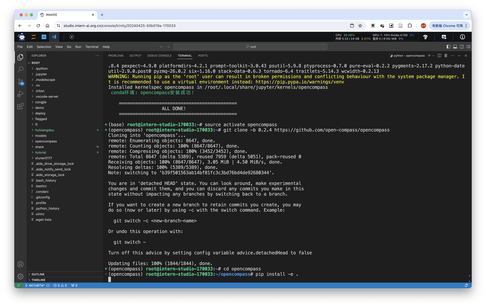
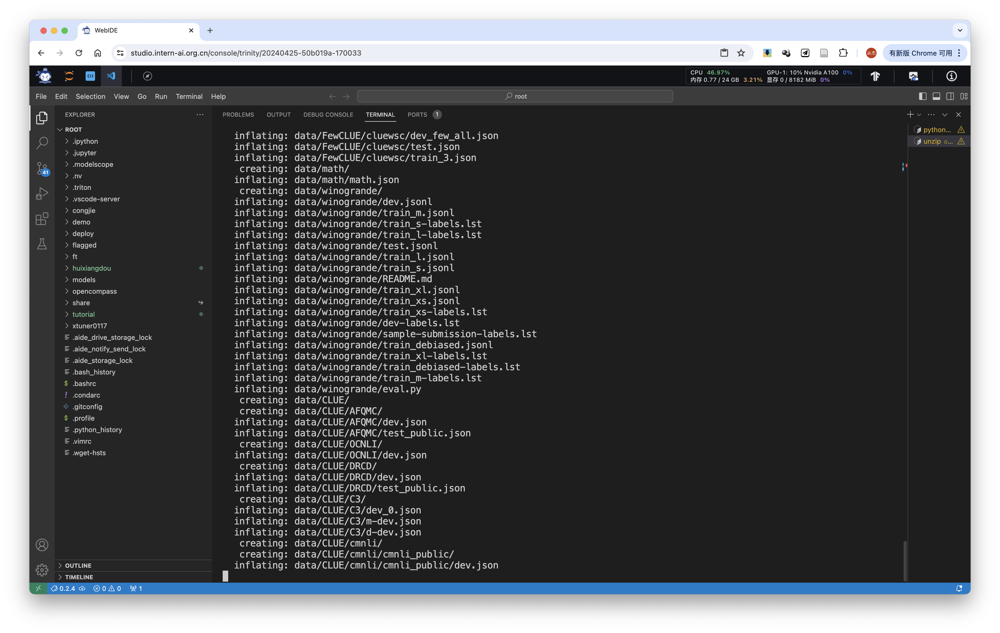
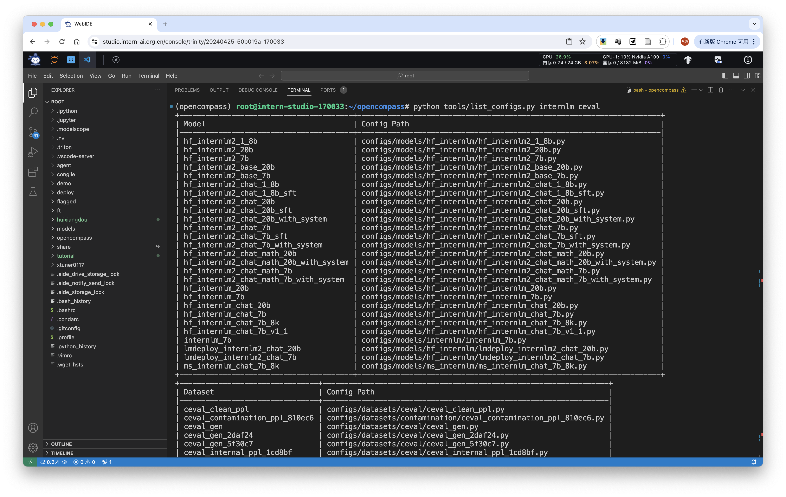
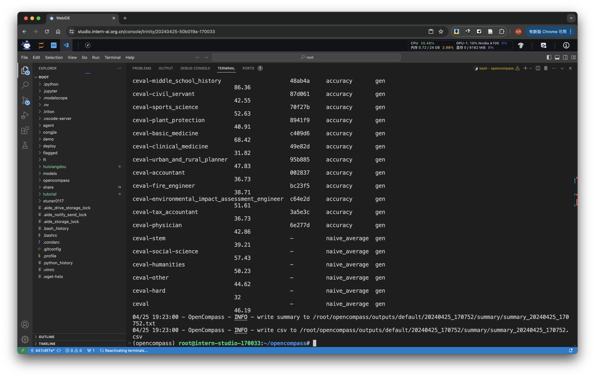

# 作业(第7节课)

基础作业

使用 OpenCompass 评测 internlm2-chat-1_8b 模型在 C-Eval 数据集上的性能

进阶作业

将自定义数据集提交至OpenCompass官网

提交地址：https://hub.opencompass.org.cn/dataset-submit?lang=[object%20Object]

提交指南：https://mp.weixin.qq.com/s/_s0a9nYRye0bmqVdwXRVCg

Tips：不强制要求配置数据集对应榜单（ leaderboard.xlsx ），可仅上传 EADME_OPENCOMPASS.md 文档

# Walkthrough

## basic part

### 1. eval internlm2-chat-1_8b with dataset C-Eval

**env preparation**

run the following command to install env
```bash
studio-conda -o internlm-base -t opencompass
source activate opencompass
git clone -b 0.2.4 https://github.com/open-compass/opencompass
cd opencompass
pip install -e .
pip install protobuf
```



**data preparation**

run the following command to copy and unzip data

```bash
cp /share/temp/datasets/OpenCompassData-core-20231110.zip /root/opencompass/
unzip OpenCompassData-core-20231110.zip
```



run `python tools/list_configs.py internlm ceval` to check supported models and datasets



**start eval**

run following command to start eval

```bash
export MKL_SERVICE_FORCE_INTEL=1
#或
export MKL_THREADING_LAYER=GNU
python run.py
--datasets ceval_gen \
--hf-path /share/new_models/Shanghai_AI_Laboratory/internlm2-chat-1_8b \  # HuggingFace 模型路径
--tokenizer-path /share/new_models/Shanghai_AI_Laboratory/internlm2-chat-1_8b \  # HuggingFace tokenizer 路径（如果与模型路径相同，可以省略）
--tokenizer-kwargs padding_side='left' truncation='left' trust_remote_code=True \  # 构建 tokenizer 的参数
--model-kwargs device_map='auto' trust_remote_code=True \  # 构建模型的参数
--max-seq-len 1024 \  # 模型可以接受的最大序列长度
--max-out-len 16 \  # 生成的最大 token 数
--batch-size 2  \  # 批量大小
--num-gpus 1  # 运行模型所需的 GPU 数量
--debug
```



## advanced part

### 1. 